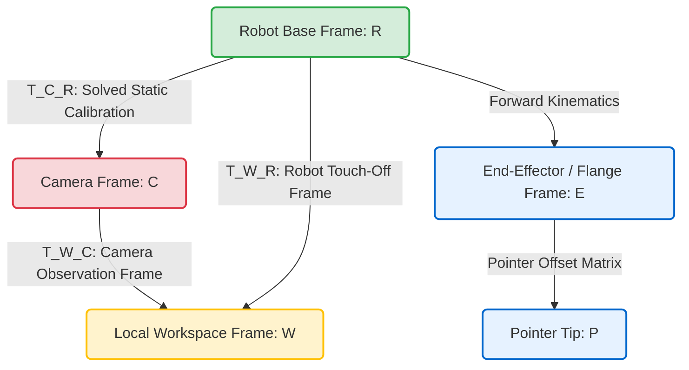
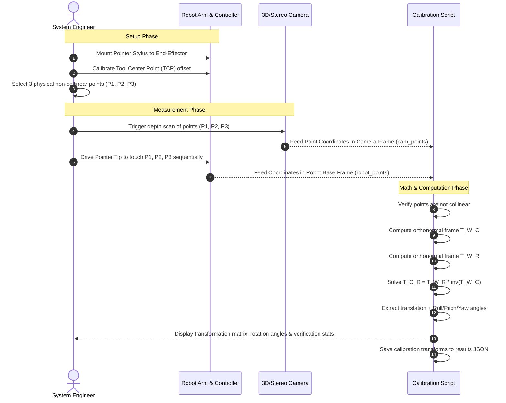

# Targetless 3D Hand-Eye Calibration Utility

[](https://opensource.org/licenses/MIT)
[](https://www.python.org/)
[](#self-test-and-validation)

A production-grade, mathematically robust, targetless 3D hand-eye calibration utility implemented in Python. 

This utility computes the static, high-precision rigid coordinate transformation $(T_C^R \in \mathrm{SE}(3))$ between a **camera's coordinate frame** and a **robot's base coordinate frame** without requiring chessboards, circle grids, or external calibration artifacts. It is based on the single-shot physical pointer touch-off methodology published in MDPI's *"Stereo-Based Single-Shot Hand-to-Eye Calibration for Robot Arms"* and incorporates structural reference frames from arXiv's *"3D Hand-Eye Calibration for Collaborative Robot Arm: Look at Robot Base Once"*.

---

## 🚀 Quick Start & Installation

```bash
# Clone the repository
git clone https://github.com/iammohith/Targetless-Hand-Eye-Calibration.git

# Navigate to the directory
cd Targetless-Hand-Eye-Calibration

# Install dependencies and the package
pip install .

# Run the built-in mathematical self-test
targetless-calibrate --test
```

---

## Table of Contents
1. [Quick Start & Installation](#-quick-start--installation)
2. [Why Targetless Calibration?](#-why-targetless-calibration)
3. [Mathematical Foundations](#%EF%B8%8F-mathematical-foundations)
4. [Architecture and Coordinate Frames](#%EF%B8%8F-architecture-and-coordinate-frames)
5. [Calibration Pipeline Workflow](#-calibration-pipeline-workflow)
6. [Code Architecture Walkthrough](#-code-architecture-walkthrough)
7. [Self-Test and Validation](#-self-test-and-validation)
8. [Production Usage Guide](#%EF%B8%8F-production-usage-guide)
9. [ROS 2 TF2 Dynamic Broadcaster Integration](#%EF%B8%8F-ros-2-tf2-dynamic-broadcaster-integration)
10. [Academic & Technical References](#-academic--technical-references)

---

## Why Targetless Calibration?

Traditional hand-eye calibration algorithms (e.g., standard Tsai-Lenz or Horaud-Dornaika solutions for $AX = XB$ or $AX = YB$ problems) typically require a multi-step process using 2D chessboard patterns, ChArUco grids, or circle patterns. These traditional methods introduce several engineering bottlenecks in industrial settings:
*   **Occlusion and Workspace Constraints**: Standard targets must be entirely visible from multiple extreme angles, which is often difficult in cluttered robotic welding cells, pick-and-place stations, or confined spaces.
*   **Physical Wear & Tear**: Optical targets degrade, warp, or accumulate dust and grease in harsh production environments, directly deteriorating calibration accuracy.
*   **Complex Multi-Pose Gathering**: Traditional systems require capturing 10–20 different robot poses to solve the calibration equation, increasing commissioning time.

### The Single-Shot Pointer Solution
This utility utilizes **three arbitrary, non-collinear physical points** in the shared workspace (such as bolts, edge vertices, or structural features) and a simple **robotic pointer tool** (or 3D-printed stylus) attached to the end-effector. 
By measuring these points relative to the camera frame (using a stereo or 3D depth sensor) and touching off on them with the calibrated robotic pointer, we establish localized coordinate systems and solve the full transform matrix sequentially and non-iteratively.

---

## Mathematical Foundations

The calibration problem establishes a closed kinematic chain by composing homogeneous transformation matrices.

```
       +--------------------+
       |  Robot Base {R}    |
       +---------+----------+
                 |
                 |  T_C_R (Camera-to-Robot Frame)
                 v
       +--------------------+
       |  Camera Frame {C}  |
       +---------+----------+
                 |
                 |  T_W_C (World-to-Camera Frame)
                 v
       +--------------------+
       |  Local World {W}   |
       +--------------------+
```

### 1. Generating a Local Orthonormal Coordinate Frame $(\{W\})$
Let $P_1, P_2, P_3 \in \mathbb{R}^3$ be three non-collinear physical coordinates. We define a local, right-handed 3D coordinate system (referred to as the "World Frame" $\{W\}$) with its origin at $P_1$:
1.  **Displacement Vectors**:

    ```math
    \vec{v}_x = P_2 - P_1
    ```

    ```math
    \vec{v}_{y'} = P_3 - P_1
    ```

2.  **Collinearity Safeguard**:
    The cross product between $\vec{v}_x$ and $\vec{v}_{y'}$ determines collinearity. If the norm of the cross product approaches zero, the points lie on a straight line, and a unique 3D coordinate system cannot be resolved:

    ```math
    \vec{n}_{cross} = \vec{v}_x \times \vec{v}_{y'}
    ```

    ```math
    \mathrm{If\ } \|\vec{n}_{cross}\|_2 < 10^{-6} \implies \mathrm{Collinear\ (Error)}
    ```

3.  **Orthonormal Basis Unit Vectors**:
    *   **Unit X-axis** $(\hat{x})$: Directed along the line from $P_1$ to $P_2$:

        ```math
        \hat{x} = \frac{\vec{v}_x}{\|\vec{v}_x\|_2}
        ```

    *   **Unit Z-axis** $(\hat{z})$: Perpendicular to the plane defined by the three points:

        ```math
        \hat{z} = \frac{\vec{n}_{cross}}{\|\vec{n}_{cross}\|_2}
        ```

    *   **Unit Y-axis** $(\hat{y})$: Orthogonalized completing the right-handed Cartesian coordinate system:

        ```math
        \hat{y} = \hat{z} \times \hat{x}
        ```

4.  **Homogeneous Transformation Matrix $(T \in \mathrm{SE}(3))$**:
    By stacking the unit vectors as column vectors of the rotation matrix $R \in \mathrm{SO}(3)$ and assigning the origin point $P_1$ as the translation vector $t \in \mathbb{R}^3$:

    ```math
    R = \begin{bmatrix} \hat{x} & \hat{y} & \hat{z} \end{bmatrix}_{3 \times 3}, \quad t = P_1
    ```

    ```math
    T = \begin{bmatrix} R & t \\ \mathbf{0}_{1 \times 3} & 1 \end{bmatrix}_{4 \times 4}
    ```

### 2. Solving for Camera-to-Robot Frame Transformation $(T_C^R)$
Using the above formulation, the script calculates:
*   $T_W^C$: The transformation from the workspace local frame $\{W\}$ to the camera frame $\{C\}$ (calculated using 3D camera measurements $\vec{p}_1, \vec{p}_2, \vec{p}_3$).
*   $T_W^R$: The transformation from the workspace local frame $\{W\}$ to the robot base frame $\{R\}$ (calculated using robot controller coordinates $\vec{q}_1, \vec{q}_2, \vec{q}_3$).

Since the physical features are static, we compose the closed-loop coordinate transform:

```math
T_W^R = T_C^R \cdot T_W^C
```

To isolate and solve for the unknown static transformation $T_C^R$, we post-multiply by the matrix inverse of $T_W^C$:

```math
T_C^R = T_W^R \cdot (T_W^C)^{-1}
```

---

## Architecture and Coordinate Frames

The relationship between coordinate frames and the closed kinematic loop is illustrated below:

### Coordinate Transformations Chain


---

## Calibration Pipeline Workflow

This targetless workflow can be executed in a few simple physical steps, followed by immediate mathematical resolution:



---

## Code Architecture Walkthrough

The utility is structured as a single self-contained, lightweight Python module (`targetless_calibration.py`) built strictly on top of standard scientific libraries (`numpy`). This makes it highly portable and easy to integrate into larger ROS, ROS 2, or industrial software pipelines.

### Key Module Components

1.  **`compute_orthonormal_frame(p1, p2, p3)`**:
    *   Takes three 3D coordinates.
    *   Computes displacement vectors.
    *   Includes a safety guard to ensure $\|\vec{n}_{cross}\|_2 \geq 1e-6$ to prevent division by zero or singular frames.
    *   Constructs and returns the homogeneous $4 \times 4$ transformation matrix.
2.  **`calibrate_camera_to_robot(cam_points, robot_points)`**:
    *   Validates point counts (exactly 3 required).
    *   Assembles $T_W^C$ and $T_W^R$.
    *   Evaluates $T_C^R = T_W^R \cdot {T_W^C}^{-1}$.
3.  **`run_self_test()`**:
    *   Contains full test coordinates sourced from MDPI experimental data.
    *   Computes the transformation matrix.
    *   Validates calibration points against predicted transforms.
    *   Computes generalization spatial error for a 4th point (un-calibrated validation point) to confirm sub-millimeter precision.

---

## Self-Test and Validation

To verify the mathematical accuracy of the script before executing it on your own hardware, run the built-in self-test suite. This test loads the exact coordinate dataset from Table 2 of the MDPI paper:

| Point | Camera Coordinates (ZED2i Frame, mm) | Robot Base Coordinates (UR10e Frame, mm) | Description |
| :---: | :---: | :---: | :---: |
| **$P_1$** | `[-56.76, -105.9, 490.43]` | `[825.0, -473.0, 13.0]` | **Origin of Workspace Frame $(P_1)$** |
| **$P_2$** | `[216.03, -102.55, 481.86]` | `[1055.53, -326.87, 13.0]` | **Defines Workspace X-Axis $(P_2)$** |
| **$P_3$** | `[-59.12, 88.58, 494.7]` | `[929.18, -637.29, 14.0]` | **Defines Workspace Y-Plane $(P_3)$** |
| **$P_{10}$** | `[137.27, -25.48, 487.02]` | `[1032.0, -434.0, 13.0]` | **Validation Point (Generalization Test)** |

### Execute the Self-Test
Run the script in your terminal using the `--test` flag:

```bash
python3 targetless_calibration.py --test
```

### Self-Test Analysis & Results
The script computes the camera-to-robot transform and provides direct validation metrics:

*   **Calculated Transformation Matrix $(T_C^R)$**:
    ```text
    [[ 0.838011  0.545521 -0.012027  936.234684]
     [ 0.544731 -0.837672 -0.039672 -511.334050]
     [-0.031717  0.026694 -0.999140  504.035068]
     [ 0.000000  0.000000  0.000000    1.000000]]
    ```
*   **Calibration Points Verification**: Error at $P_1$ and $P_2$ is mathematically **0.0000 mm**, and at $P_3$ is **0.1385 mm**.
*   **Generalization Error on $P_{10}$**: **0.9417 mm** (Sub-millimeter performance, which is well within standard collaborative robot spatial resolution and matches the paper's physical performance).

---

## Production Usage Guide

### Step 1: Prepare Your Point Map JSON File
Generate a JSON configuration file containing your 3 camera-based measurements and corresponding 3 robot-based measurements. Name it `points.json`:

```json
{
    "camera_points": [
        [-56.76, -105.9, 490.43],
        [216.03, -102.55, 481.86],
        [-59.12, 88.58, 494.7]
    ],
    "robot_points": [
        [825.0, -473.0, 13.0],
        [1055.53, -326.87, 13.0],
        [929.18, -637.29, 14.0]
    ]
}
```

### Step 2: Run Calibration Command
Execute the script, passing your JSON input and defining where to output the results:

```bash
python3 targetless_calibration.py --input points.json --out results.json
```

### Output File Structure
The output JSON (`results.json`) stores the computed homogeneous matrix, the translation vectors, and standard robotic Euler angles (Roll, Pitch, Yaw):

```json
{
  "T_C_R": [
    [0.8380108089455325, 0.545521062973972, -0.012027219904746206, 936.2346842603889],
    [0.5447310543669145, -0.8376718868661647, -0.03967226326880053, -511.3340498114389],
    [-0.031716919246197926, 0.02669418534125867, -0.9991403588267035, 504.0350682855598],
    [0.0, 0.0, 0.0, 1.0]
  ],
  "translation_mm": [
    936.2346842603889,
    -511.3340498114389,
    504.0350682855598
  ],
  "euler_angles_deg": {
    "roll_x": 178.47000551717208,
    "pitch_y": 1.8174523910398687,
    "yaw_z": 33.023249117621184
  }
}
```

---

## ROS 2 TF2 Dynamic Broadcaster Integration

To dynamically integrate this solved transformation into a collaborative ROS 2 pipeline (Humble, Iron, or Jazzy), you can wrap the mathematical output into a TF2 static transform publisher node.

Below is an engineering template to achieve this:

```python
#!/usr/bin/env python3
import sys
import json
import rclpy
from rclpy.node import Node
from geometry_msgs.msg import TransformStamped
from tf2_ros.static_transform_broadcaster import StaticTransformBroadcaster
import numpy as np

class TargetlessTFPublisher(Node):
    def __init__(self, calibration_file):
        super().__init__('targetless_tf_publisher')
        self.tf_broadcaster = StaticTransformBroadcaster(self)
        self.publish_transform(calibration_file)

    def publish_transform(self, calibration_file):
        # 1. Load Calibration Results
        with open(calibration_file, 'r') as f:
            data = json.load(f)
        
        t_matrix = np.array(data['T_C_R'])
        
        # 2. Extract rotation matrix (R) & translation (t)
        # Convert translation from mm to meters for ROS
        tx = t_matrix[0, 3] / 1000.0
        ty = t_matrix[1, 3] / 1000.0
        tz = t_matrix[2, 3] / 1000.0
        
        R = t_matrix[0:3, 0:3]
        
        # 3. Convert Rotation Matrix to Quaternion (w, x, y, z)
        qw = np.sqrt(max(0, 1 + R[0,0] + R[1,1] + R[2,2])) / 2.0
        qx = np.sign(R[2,1] - R[1,2]) * np.sqrt(max(0, 1 + R[0,0] - R[1,1] - R[2,2])) / 2.0
        qy = np.sign(R[0,2] - R[2,0]) * np.sqrt(max(0, 1 - R[0,0] + R[1,1] - R[2,2])) / 2.0
        qz = np.sign(R[1,0] - R[0,1]) * np.sqrt(max(0, 1 - R[0,0] - R[1,1] + R[2,2])) / 2.0

        # 4. Populate TF Message
        static_transformStamped = TransformStamped()
        static_transformStamped.header.stamp = self.get_clock().now().to_msg()
        static_transformStamped.header.frame_id = 'robot_base'  # Parent frame
        static_transformStamped.child_frame_id = 'camera_link'   # Child frame

        static_transformStamped.transform.translation.x = tx
        static_transformStamped.transform.translation.y = ty
        static_transformStamped.transform.translation.z = tz
        
        static_transformStamped.transform.rotation.x = qx
        static_transformStamped.transform.rotation.y = qy
        static_transformStamped.transform.rotation.z = qz
        static_transformStamped.transform.rotation.w = qw

        self.tf_broadcaster.sendTransform(static_transformStamped)
        self.get_logger().info(f"Published static TF: [robot_base] -> [camera_link]")

def main():
    if len(sys.argv) < 2:
        print("Usage: ros2 run targetless_calibration tf_publisher_node.py <path_to_results.json>")
        return
    
    rclpy.init()
    node = TargetlessTFPublisher(sys.argv[1])
    try:
        rclpy.spin(node)
    except KeyboardInterrupt:
        pass
    rclpy.shutdown()

if __name__ == '__main__':
    main()
```

---

## 📚 Academic & Technical References

The theoretical, mathematical, and algorithmic structures incorporated in this utility are grounded directly in the following academic publications and open sources:

1.  **Stereo Pointer Method (Base Algorithm)**:  
    *Stereo-Based Single-Shot Hand-to-Eye Calibration for Robot Arms* (MDPI).  
    Discusses the coordinate frame orthogonalization equations and pointer touch-off performance using physical stereo cameras.

2.  **Point Cloud-based Targetless Calibration (LRBO)**:  
    *3D Hand-Eye Calibration for Collaborative Robot Arm: Look at Robot Base Once* (arXiv).  
    Features deep neural registration architectures (e.g., PREDATOR) and CAD base simulation strategies to calibrate arms without target patterns.

3.  **Kronecker Product & Dual Quaternions (Linear Simultaneous Solvers)**:  
    *Simultaneous robot-world and hand-eye calibration using dual-quaternions and Kronecker product* (Academic Journals).  
    Explores mathematically rigorous linear formulations for simultaneous hand-eye calibration.

4.  **Mathematical Background on Hand-Eye Formulation**:  
    *   *A computationally efficient method for hand–eye calibration* (PMC).  
    *   *Hand–eye calibration problem* (Wikipedia).

5.  **Industry Frameworks**:  
    *   *What Is Robot Hand-Eye Calibration?* (MATLAB & Simulink, MathWorks).  
    *   *Hand Eye Calibration: What It Fixes And What It Cannot* (Viroteq).

---
